# Comprehension Reading and Quiz Application - Architecture Documentation

## Table of Contents
1. [System Overview](#system-overview)
2. [Architecture Diagram](#architecture-diagram)
3. [Component Descriptions](#component-descriptions)
4. [Technology Stack](#technology-stack)
5. [Data Flow](#data-flow)
6. [User Interface Design](#user-interface-design)
7. [Deployment Considerations](#deployment-considerations)

## System Overview

The Comprehension Reading and Quiz Application is a full-stack web application designed to manage reading comprehensions and associated quizzes. The system provides two primary interfaces:

- **Admin Interface**: For creating, editing, and managing comprehensions and quizzes
- **User Interface**: For searching, reading comprehensions, and taking quizzes

### High-Level Architecture

The application follows a three-tier architecture pattern:

1. **Presentation Layer**: Python Dash web framework for building interactive user interfaces
2. **Application Layer**: FastAPI REST API for business logic and data processing
3. **Data Layer**: SQL database (PostgreSQL/SQLite) for persistent data storage

## Architecture Diagram


## Component Descriptions

### 1. Frontend - Python Dash

**Framework**: Dash by Plotly - A Python framework for building reactive web applications

**Key Components**:

#### Admin Tab Components
- **Comprehension Form**: Input fields for title, content, and difficulty level
- **Quiz Form**: Input fields for questions, multiple choice options, correct answer, and explanation
- **Data Grid**: Displays existing comprehensions and quizzes with edit/delete actions
- **Modal Dialogs**: For editing existing records

#### User Tab Components
- **Search Bar**: Text input with filters for title and difficulty level
- **Comprehension Display**: Scrollable text area for reading passages
- **Quiz Interface**: Radio buttons for multiple choice questions
- **Results Display**: Shows score and explanations after quiz submission

**Responsibilities**:
- Render interactive UI components
- Handle user interactions and form submissions
- Make HTTP requests to FastAPI backend
- Display data received from API
- Manage client-side state (selected comprehension, current quiz, etc.)
- Provide responsive and accessible user experience

### 2. Backend - FastAPI

**Framework**: FastAPI - Modern, fast Python web framework for building APIs

**Key Components**:

#### Router Modules
1. **Comprehensions Router** (`/api/comprehensions`)
   - Handle CRUD operations for comprehensions
   - Validate input data using Pydantic models
   - Return JSON responses

2. **Quiz Router** (`/api/quizzes`)
   - Handle CRUD operations for quizzes
   - Link quizzes to comprehensions via foreign keys
   - Score quiz submissions
   - Return quiz results with explanations

3. **Search Router** (`/api/search`)
   - Implement search functionality
   - Support filtering by title, difficulty, etc.
   - Return paginated results

**Responsibilities**:
- Expose RESTful API endpoints
- Validate and sanitize input data
- Implement business logic (quiz scoring, search algorithms)
- Handle database operations via ORM/SQL
- Return structured JSON responses
- Handle errors and exceptions gracefully
- Implement authentication and authorization (future enhancement)

### 3. Database Layer - SQL Database

**Options**: PostgreSQL (production) or SQLite (development/testing)

**Components**:

#### Database Connection
- **SQLAlchemy ORM**: Python SQL toolkit for database operations
- **Connection Pool**: Manages database connections efficiently
- **Migration Tool**: Alembic for database schema versioning

#### Tables
- **comprehensions**: Stores reading passages
- **quizzes**: Stores quiz questions linked to comprehensions

**Responsibilities**:
- Persist application data
- Enforce data integrity through constraints
- Support complex queries for search functionality
- Maintain relationships between tables
- Provide ACID guarantees for transactions

See [DATABASE_SCHEMA.md](./DATABASE_SCHEMA.md) for detailed schema design.

## Technology Stack

### Frontend
- **Python Dash**: v2.14+ - Web application framework
- **Dash Bootstrap Components**: UI component library
- **Plotly**: For potential data visualizations

### Backend
- **FastAPI**: v0.104+ - Web framework
- **Pydantic**: v2.4+ - Data validation
- **SQLAlchemy**: v2.0+ - ORM
- **Alembic**: Database migrations
- **python-jose**: JWT token handling (for auth)
- **passlib**: Password hashing (for auth)

### Database
- **PostgreSQL**: v14+ (production)
- **SQLite**: v3.37+ (development)

### Development Tools
- **pytest**: Testing framework
- **black**: Code formatting
- **flake8**: Code linting
- **mypy**: Static type checking

## Data Flow

### 1. Admin Creates Comprehension


### 2. Admin Creates Quiz


### 3. User Searches Comprehensions


### 4. User Takes Quiz

```mermaid
sequenceDiagram
    participant User
    participant DashUI
    participant FastAPI
    participant Database
    
    User->>DashUI: Select comprehension
    DashUI->>FastAPI: GET /api/comprehensions/{id}
    FastAPI->>Database: SELECT FROM comprehensions
    Database-->>FastAPI: Return comprehension
    FastAPI-->>DashUI: 200 OK + comprehension data
    DashUI-->>User: Display reading passage
    
    User->>DashUI: Click "Take Quiz"
    DashUI->>FastAPI: GET /api/quizzes?comprehension_id={id}
    FastAPI->>Database: SELECT FROM quizzes WHERE...
    Database-->>FastAPI: Return quiz questions
    FastAPI-->>DashUI: 200 OK + quiz questions
    DashUI-->>User: Display quiz questions
    
    User->>DashUI: Select answers
    User->>DashUI: Click "Submit"
    DashUI->>FastAPI: POST /api/quizzes/submit
    FastAPI->>FastAPI: Score answers
    FastAPI->>Database: SELECT correct_answer, explanation
    Database-->>FastAPI: Return correct answers
    FastAPI-->>DashUI: 200 OK + results + explanations
    DashUI-->>User: Display score and feedback
```



## User Interface Design

### Admin Tab

The Admin interface provides comprehensive management capabilities:

#### Features:
1. **Comprehension Management**
   - Create new comprehension with title, content, difficulty
   - Edit existing comprehensions
   - Delete comprehensions (cascade delete associated quizzes)
   - View list of all comprehensions in a data table

2. **Quiz Management**
   - Select a comprehension to create quiz for
   - Add multiple quiz questions per comprehension
   - Edit quiz questions, options, correct answers
   - Delete individual quiz questions
   - Preview quiz questions

#### Layout:
```
+----------------------------------+
|  Admin Tab                       |
+----------------------------------+
|  [Comprehension Section]         |
|  Title: [____________]           |
|  Content: [____________]         |
|            [____________]        |
|  Difficulty: [Easy v]            |
|  [Create Comprehension]          |
+----------------------------------+
|  [Quiz Section]                  |
|  Comprehension: [Select v]       |
|  Question: [____________]        |
|  Option A: [____________]        |
|  Option B: [____________]        |
|  Option C: [____________]        |
|  Option D: [____________]        |
|  Correct: [A v]                  |
|  Explanation: [____________]     |
|  [Create Quiz]                   |
+----------------------------------+
|  [Data Grid]                     |
|  ID | Title | Difficulty | [Edit] [Delete] |
+----------------------------------+
```

### User Tab

The User interface focuses on learning and assessment:

#### Features:
1. **Search & Browse**
   - Search by title or keywords
   - Filter by difficulty level
   - View comprehension previews

2. **Reading Interface**
   - Display full comprehension text
   - Clean, readable typography
   - Scroll support for long passages

3. **Quiz Taking**
   - Display questions one at a time or all at once
   - Radio buttons for answer selection
   - Submit button to complete quiz
   - Timer display (optional feature)

4. **Results & Feedback**
   - Display score (e.g., "8/10 correct")
   - Show correct answers
   - Display explanations for each question
   - Option to retake quiz

#### Layout:
```
+----------------------------------+
|  User Tab                        |
+----------------------------------+
|  Search: [____________] [Search] |
|  Difficulty: [All v]             |
+----------------------------------+
|  [Comprehension Results]         |
|  > Title 1 (Easy) - Preview...   |
|  > Title 2 (Medium) - Preview... |
+----------------------------------+
|  [Selected Comprehension]        |
|  Title: Understanding Photosyn.. |
|  Difficulty: Easy                |
|  Content:                        |
|  Lorem ipsum dolor sit amet...   |
|  ...                             |
|  [Take Quiz]                     |
+----------------------------------+
|  [Quiz Interface]                |
|  Question 1: What is...?         |
|  ( ) A. Option A                 |
|  ( ) B. Option B                 |
|  ( ) C. Option C                 |
|  ( ) D. Option D                 |
|  [Submit Answers]                |
+----------------------------------+
```

## Deployment Considerations

### Development Environment
- Run FastAPI with `uvicorn` development server
- Run Dash with built-in development server
- Use SQLite for quick setup
- Hot reload enabled for both frontend and backend

### Production Environment
- Deploy FastAPI with `gunicorn` + `uvicorn` workers
- Deploy Dash behind reverse proxy (nginx)
- Use PostgreSQL for production database
- Enable CORS appropriately
- Implement rate limiting
- Add logging and monitoring
- Use environment variables for configuration
- Implement proper error handling and user feedback

### Containerization
```yaml
# docker-compose.yml structure
services:
  frontend:
    - Dash application
    - Port 8050
  backend:
    - FastAPI application  
    - Port 8000
  database:
    - PostgreSQL
    - Port 5432
```

### Security Considerations
- Input validation on both frontend and backend
- SQL injection prevention through ORM
- XSS protection in Dash components
- HTTPS in production
- Authentication and authorization (JWT tokens)
- Rate limiting on API endpoints
- Secure password storage (bcrypt)

## API Integration

The Dash frontend communicates with FastAPI backend through HTTP requests:

```python
# Example Dash callback
@app.callback(
    Output('comprehension-display', 'children'),
    Input('comprehension-id', 'value')
)
def load_comprehension(comp_id):
    response = requests.get(f'{API_URL}/api/comprehensions/{comp_id}')
    if response.status_code == 200:
        data = response.json()
        return data['content']
    return "Error loading comprehension"
```

See [API_DESIGN.md](./API_DESIGN.md) for complete API documentation.

## Future Enhancements

1. **User Authentication**: Login system for students and admins
2. **Progress Tracking**: Track user quiz scores over time
3. **Analytics Dashboard**: Visualize quiz performance statistics
4. **Difficulty Scoring**: Automatic difficulty assessment based on user performance
5. **Rich Text Editor**: Support for formatted text, images in comprehensions
6. **Timed Quizzes**: Add time limits for quiz completion
7. **Multiple Quiz Types**: Support true/false, fill-in-the-blank questions
8. **Export/Import**: CSV or JSON export/import for bulk data management
9. **Mobile App**: React Native or Flutter mobile application
10. **Accessibility**: WCAG 2.1 AA compliance

---

*For detailed information, see:*
- [Database Schema Documentation](./DATABASE_SCHEMA.md)
- [API Design Documentation](./API_DESIGN.md)
