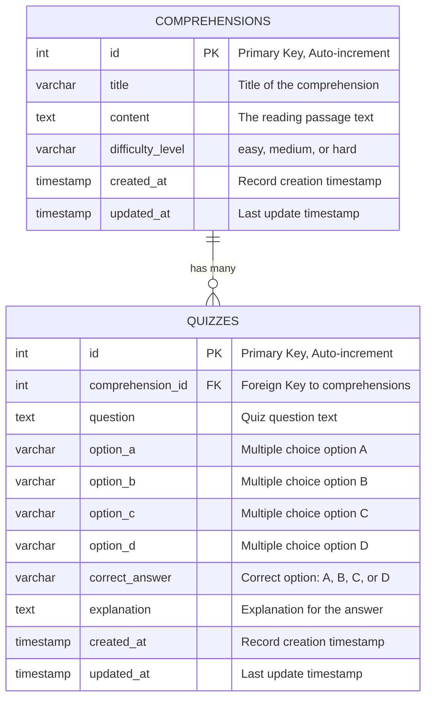

# Database Schema Documentation

## Table of Contents
1. [Overview](#overview)
2. [Entity Relationship Diagram](#entity-relationship-diagram)
3. [Table Schemas](#table-schemas)
4. [Relationships](#relationships)
5. [Indexes](#indexes)
6. [Sample Data](#sample-data)
7. [SQL Scripts](#sql-scripts)

## Overview

The database schema supports a Comprehension Reading and Quiz Application with two main entities:
- **Comprehensions**: Reading passages that users can study
- **Quizzes**: Multiple choice questions associated with comprehensions

The schema follows relational database best practices with proper normalization, foreign key constraints, and indexing for performance.

**Database Options**:
- **Development**: SQLite (file-based, easy setup)
- **Production**: PostgreSQL (robust, scalable, feature-rich)

## Entity Relationship Diagram



## Table Schemas

### 1. comprehensions

Stores reading passages that users can read and learn from.

#### Schema Definition

| Column Name | Data Type | Constraints | Description |
|------------|-----------|-------------|-------------|
| `id` | INTEGER | PRIMARY KEY, AUTO_INCREMENT | Unique identifier for each comprehension |
| `title` | VARCHAR(255) | NOT NULL | Title of the comprehension passage |
| `content` | TEXT | NOT NULL | The full reading passage text |
| `difficulty_level` | VARCHAR(20) | NOT NULL, CHECK IN ('easy', 'medium', 'hard') | Difficulty classification |
| `created_at` | TIMESTAMP | NOT NULL, DEFAULT CURRENT_TIMESTAMP | Record creation timestamp |
| `updated_at` | TIMESTAMP | NOT NULL, DEFAULT CURRENT_TIMESTAMP ON UPDATE | Last modification timestamp |

#### Constraints
- **Primary Key**: `id`
- **Check Constraint**: `difficulty_level` must be one of: 'easy', 'medium', 'hard'
- **Not Null**: All columns except none (all required)
- **Unique**: None (titles can be duplicated if needed)

#### Example SQLAlchemy Model

```python
from sqlalchemy import Column, Integer, String, Text, DateTime, CheckConstraint
from sqlalchemy.sql import func
from database import Base

class Comprehension(Base):
    __tablename__ = "comprehensions"
    
    id = Column(Integer, primary_key=True, index=True)
    title = Column(String(255), nullable=False, index=True)
    content = Column(Text, nullable=False)
    difficulty_level = Column(
        String(20), 
        nullable=False,
        index=True
    )
    created_at = Column(DateTime(timezone=True), server_default=func.now(), nullable=False)
    updated_at = Column(
        DateTime(timezone=True), 
        server_default=func.now(), 
        onupdate=func.now(),
        nullable=False
    )
    
    # Relationships
    quizzes = relationship("Quiz", back_populates="comprehension", cascade="all, delete-orphan")
    
    __table_args__ = (
        CheckConstraint(
            "difficulty_level IN ('easy', 'medium', 'hard')",
            name="valid_difficulty_level"
        ),
    )
```

### 2. quizzes

Stores quiz questions associated with comprehensions for assessment purposes.

#### Schema Definition

| Column Name | Data Type | Constraints | Description |
|------------|-----------|-------------|-------------|
| `id` | INTEGER | PRIMARY KEY, AUTO_INCREMENT | Unique identifier for each quiz question |
| `comprehension_id` | INTEGER | FOREIGN KEY, NOT NULL | References comprehensions(id) |
| `question` | TEXT | NOT NULL | The quiz question text |
| `option_a` | VARCHAR(500) | NOT NULL | Multiple choice option A |
| `option_b` | VARCHAR(500) | NOT NULL | Multiple choice option B |
| `option_c` | VARCHAR(500) | NOT NULL | Multiple choice option C |
| `option_d` | VARCHAR(500) | NOT NULL | Multiple choice option D |
| `correct_answer` | VARCHAR(1) | NOT NULL, CHECK IN ('A', 'B', 'C', 'D') | The correct option |
| `explanation` | TEXT | NULL | Optional explanation for the correct answer |
| `created_at` | TIMESTAMP | NOT NULL, DEFAULT CURRENT_TIMESTAMP | Record creation timestamp |
| `updated_at` | TIMESTAMP | NOT NULL, DEFAULT CURRENT_TIMESTAMP ON UPDATE | Last modification timestamp |

#### Constraints
- **Primary Key**: `id`
- **Foreign Key**: `comprehension_id` REFERENCES `comprehensions(id)` ON DELETE CASCADE
- **Check Constraint**: `correct_answer` must be one of: 'A', 'B', 'C', 'D'
- **Not Null**: All columns except `explanation` (optional)
- **Index**: On `comprehension_id` for efficient queries

#### Example SQLAlchemy Model

```python
from sqlalchemy import Column, Integer, String, Text, DateTime, ForeignKey, CheckConstraint
from sqlalchemy.orm import relationship
from sqlalchemy.sql import func
from database import Base

class Quiz(Base):
    __tablename__ = "quizzes"
    
    id = Column(Integer, primary_key=True, index=True)
    comprehension_id = Column(
        Integer, 
        ForeignKey("comprehensions.id", ondelete="CASCADE"),
        nullable=False,
        index=True
    )
    question = Column(Text, nullable=False)
    option_a = Column(String(500), nullable=False)
    option_b = Column(String(500), nullable=False)
    option_c = Column(String(500), nullable=False)
    option_d = Column(String(500), nullable=False)
    correct_answer = Column(String(1), nullable=False)
    explanation = Column(Text, nullable=True)
    created_at = Column(DateTime(timezone=True), server_default=func.now(), nullable=False)
    updated_at = Column(
        DateTime(timezone=True), 
        server_default=func.now(), 
        onupdate=func.now(),
        nullable=False
    )
    
    # Relationships
    comprehension = relationship("Comprehension", back_populates="quizzes")
    
    __table_args__ = (
        CheckConstraint(
            "correct_answer IN ('A', 'B', 'C', 'D')",
            name="valid_correct_answer"
        ),
    )
```

## Relationships

### One-to-Many: Comprehensions to Quizzes

**Relationship Type**: One-to-Many (1:N)

**Description**: One comprehension can have multiple quiz questions, but each quiz question belongs to exactly one comprehension.

**Implementation**:
- **Parent Table**: `comprehensions`
- **Child Table**: `quizzes`
- **Foreign Key**: `quizzes.comprehension_id` → `comprehensions.id`
- **Cascade**: ON DELETE CASCADE (deleting a comprehension deletes all associated quizzes)

**Business Rules**:
1. A comprehension can exist without quizzes (newly created)
2. A quiz cannot exist without a comprehension (must reference valid comprehension)
3. When a comprehension is deleted, all associated quizzes are automatically deleted
4. A comprehension can have unlimited quizzes (recommended: 5-15 per comprehension)

**Query Examples**:

```sql
-- Get all quizzes for a specific comprehension
SELECT * FROM quizzes 
WHERE comprehension_id = 1
ORDER BY created_at;

-- Get comprehension with its quiz count
SELECT 
    c.id,
    c.title,
    c.difficulty_level,
    COUNT(q.id) as quiz_count
FROM comprehensions c
LEFT JOIN quizzes q ON c.id = q.comprehension_id
GROUP BY c.id, c.title, c.difficulty_level;

-- Get comprehensions that have at least 5 quizzes
SELECT 
    c.id,
    c.title,
    COUNT(q.id) as quiz_count
FROM comprehensions c
INNER JOIN quizzes q ON c.id = q.comprehension_id
GROUP BY c.id, c.title
HAVING COUNT(q.id) >= 5;
```

## Indexes

Indexes improve query performance for frequently accessed data patterns.

### Primary Indexes (Automatic)
- `comprehensions.id` - Primary key index
- `quizzes.id` - Primary key index

### Foreign Key Indexes
- `quizzes.comprehension_id` - Speeds up JOIN operations and CASCADE deletes

### Search Indexes
- `comprehensions.title` - For title-based search queries
- `comprehensions.difficulty_level` - For filtering by difficulty

### Composite Indexes (Optional)

```sql
-- For searching comprehensions by title and difficulty
CREATE INDEX idx_comp_title_difficulty 
ON comprehensions(title, difficulty_level);

-- For finding quizzes by comprehension and creation date
CREATE INDEX idx_quiz_comp_created 
ON quizzes(comprehension_id, created_at);
```

### Full-Text Search (PostgreSQL)

For advanced search capabilities:

```sql
-- Add full-text search on comprehension title and content
CREATE INDEX idx_comp_fulltext 
ON comprehensions 
USING GIN(to_tsvector('english', title || ' ' || content));

-- Query using full-text search
SELECT * FROM comprehensions
WHERE to_tsvector('english', title || ' ' || content) 
@@ to_tsquery('english', 'photosynthesis & plants');
```

## Sample Data

### Sample Comprehensions

```sql
INSERT INTO comprehensions (title, content, difficulty_level) VALUES
(
    'Understanding Photosynthesis',
    'Photosynthesis is the process by which green plants and some other organisms use sunlight to synthesize nutrients from carbon dioxide and water. This process occurs in the chloroplasts of plant cells, specifically using chlorophyll, the green pigment that captures light energy. The overall equation for photosynthesis is: 6CO2 + 6H2O + light energy → C6H12O6 + 6O2. This means that carbon dioxide and water, in the presence of light, are converted into glucose and oxygen. The oxygen produced is released into the atmosphere, which is essential for most life on Earth.',
    'easy'
),
(
    'The Water Cycle',
    'The water cycle, also known as the hydrological cycle, describes the continuous movement of water on, above, and below the surface of the Earth. Water can change states among liquid, vapor, and ice at various places in the water cycle. The process includes evaporation, condensation, precipitation, and collection. Evaporation occurs when the sun heats up water in rivers, lakes, or the ocean and turns it into vapor or steam. Condensation happens when water vapor in the air gets cold and changes back into liquid, forming clouds. Precipitation occurs when so much water has condensed that the air cannot hold it anymore, and it falls back to Earth as rain, hail, sleet, or snow.',
    'medium'
);
```

### Sample Quizzes

```sql
-- Quizzes for "Understanding Photosynthesis" (comprehension_id = 1)
INSERT INTO quizzes (comprehension_id, question, option_a, option_b, option_c, option_d, correct_answer, explanation) VALUES
(
    1,
    'What is the primary function of chlorophyll in photosynthesis?',
    'To store water',
    'To capture light energy',
    'To release oxygen',
    'To produce glucose',
    'B',
    'Chlorophyll is the green pigment in plants that captures light energy from the sun, which is then used to convert carbon dioxide and water into glucose and oxygen.'
),
(
    1,
    'What is produced as a byproduct of photosynthesis?',
    'Carbon dioxide',
    'Nitrogen',
    'Oxygen',
    'Hydrogen',
    'C',
    'Oxygen (O2) is released as a byproduct when plants convert carbon dioxide and water into glucose during photosynthesis. This oxygen is essential for most life on Earth.'
),
(
    1,
    'Where does photosynthesis occur in plant cells?',
    'Nucleus',
    'Mitochondria',
    'Chloroplasts',
    'Cell membrane',
    'C',
    'Photosynthesis occurs in the chloroplasts, which are specialized organelles found in plant cells that contain chlorophyll.'
);

-- Quizzes for "The Water Cycle" (comprehension_id = 2)
INSERT INTO quizzes (comprehension_id, question, option_a, option_b, option_c, option_d, correct_answer, explanation) VALUES
(
    2,
    'What process turns water vapor in the air into liquid water?',
    'Evaporation',
    'Condensation',
    'Precipitation',
    'Collection',
    'B',
    'Condensation is the process where water vapor in the air cools down and changes back into liquid water, forming clouds.'
),
(
    2,
    'Which of the following is NOT a form of precipitation?',
    'Rain',
    'Snow',
    'Evaporation',
    'Hail',
    'C',
    'Evaporation is the process where liquid water turns into water vapor, not a form of precipitation. Precipitation includes rain, snow, hail, and sleet.'
);
```

## SQL Scripts

### Database Creation (PostgreSQL)

```sql
-- Create database
CREATE DATABASE comprehension_quiz_app;

-- Connect to database
\c comprehension_quiz_app;

-- Create comprehensions table
CREATE TABLE comprehensions (
    id SERIAL PRIMARY KEY,
    title VARCHAR(255) NOT NULL,
    content TEXT NOT NULL,
    difficulty_level VARCHAR(20) NOT NULL CHECK (difficulty_level IN ('easy', 'medium', 'hard')),
    created_at TIMESTAMP WITH TIME ZONE DEFAULT CURRENT_TIMESTAMP NOT NULL,
    updated_at TIMESTAMP WITH TIME ZONE DEFAULT CURRENT_TIMESTAMP NOT NULL
);

-- Create index for searching
CREATE INDEX idx_comp_title ON comprehensions(title);
CREATE INDEX idx_comp_difficulty ON comprehensions(difficulty_level);

-- Create trigger to update updated_at
CREATE OR REPLACE FUNCTION update_updated_at_column()
RETURNS TRIGGER AS $$
BEGIN
    NEW.updated_at = CURRENT_TIMESTAMP;
    RETURN NEW;
END;
$$ LANGUAGE plpgsql;

CREATE TRIGGER update_comprehensions_updated_at
    BEFORE UPDATE ON comprehensions
    FOR EACH ROW
    EXECUTE FUNCTION update_updated_at_column();

-- Create quizzes table
CREATE TABLE quizzes (
    id SERIAL PRIMARY KEY,
    comprehension_id INTEGER NOT NULL REFERENCES comprehensions(id) ON DELETE CASCADE,
    question TEXT NOT NULL,
    option_a VARCHAR(500) NOT NULL,
    option_b VARCHAR(500) NOT NULL,
    option_c VARCHAR(500) NOT NULL,
    option_d VARCHAR(500) NOT NULL,
    correct_answer VARCHAR(1) NOT NULL CHECK (correct_answer IN ('A', 'B', 'C', 'D')),
    explanation TEXT,
    created_at TIMESTAMP WITH TIME ZONE DEFAULT CURRENT_TIMESTAMP NOT NULL,
    updated_at TIMESTAMP WITH TIME ZONE DEFAULT CURRENT_TIMESTAMP NOT NULL
);

-- Create indexes
CREATE INDEX idx_quiz_comprehension ON quizzes(comprehension_id);

-- Create trigger to update updated_at
CREATE TRIGGER update_quizzes_updated_at
    BEFORE UPDATE ON quizzes
    FOR EACH ROW
    EXECUTE FUNCTION update_updated_at_column();
```

### Database Creation (SQLite)

```sql
-- Create comprehensions table
CREATE TABLE comprehensions (
    id INTEGER PRIMARY KEY AUTOINCREMENT,
    title TEXT NOT NULL,
    content TEXT NOT NULL,
    difficulty_level TEXT NOT NULL CHECK (difficulty_level IN ('easy', 'medium', 'hard')),
    created_at DATETIME DEFAULT CURRENT_TIMESTAMP NOT NULL,
    updated_at DATETIME DEFAULT CURRENT_TIMESTAMP NOT NULL
);

-- Create indexes
CREATE INDEX idx_comp_title ON comprehensions(title);
CREATE INDEX idx_comp_difficulty ON comprehensions(difficulty_level);

-- Create trigger to update updated_at
CREATE TRIGGER update_comprehensions_updated_at
    AFTER UPDATE ON comprehensions
    FOR EACH ROW
BEGIN
    UPDATE comprehensions 
    SET updated_at = CURRENT_TIMESTAMP 
    WHERE id = NEW.id;
END;

-- Create quizzes table
CREATE TABLE quizzes (
    id INTEGER PRIMARY KEY AUTOINCREMENT,
    comprehension_id INTEGER NOT NULL,
    question TEXT NOT NULL,
    option_a TEXT NOT NULL,
    option_b TEXT NOT NULL,
    option_c TEXT NOT NULL,
    option_d TEXT NOT NULL,
    correct_answer TEXT NOT NULL CHECK (correct_answer IN ('A', 'B', 'C', 'D')),
    explanation TEXT,
    created_at DATETIME DEFAULT CURRENT_TIMESTAMP NOT NULL,
    updated_at DATETIME DEFAULT CURRENT_TIMESTAMP NOT NULL,
    FOREIGN KEY (comprehension_id) REFERENCES comprehensions(id) ON DELETE CASCADE
);

-- Create indexes
CREATE INDEX idx_quiz_comprehension ON quizzes(comprehension_id);

-- Create trigger to update updated_at
CREATE TRIGGER update_quizzes_updated_at
    AFTER UPDATE ON quizzes
    FOR EACH ROW
BEGIN
    UPDATE quizzes 
    SET updated_at = CURRENT_TIMESTAMP 
    WHERE id = NEW.id;
END;
```

### Migration Strategy

When using Alembic for migrations:

```python
# alembic/versions/001_initial_schema.py
from alembic import op
import sqlalchemy as sa

def upgrade():
    # Create comprehensions table
    op.create_table(
        'comprehensions',
        sa.Column('id', sa.Integer(), nullable=False),
        sa.Column('title', sa.String(length=255), nullable=False),
        sa.Column('content', sa.Text(), nullable=False),
        sa.Column('difficulty_level', sa.String(length=20), nullable=False),
        sa.Column('created_at', sa.DateTime(timezone=True), server_default=sa.text('now()'), nullable=False),
        sa.Column('updated_at', sa.DateTime(timezone=True), server_default=sa.text('now()'), nullable=False),
        sa.PrimaryKeyConstraint('id'),
        sa.CheckConstraint("difficulty_level IN ('easy', 'medium', 'hard')", name='valid_difficulty_level')
    )
    op.create_index('idx_comp_title', 'comprehensions', ['title'])
    op.create_index('idx_comp_difficulty', 'comprehensions', ['difficulty_level'])
    
    # Create quizzes table
    op.create_table(
        'quizzes',
        sa.Column('id', sa.Integer(), nullable=False),
        sa.Column('comprehension_id', sa.Integer(), nullable=False),
        sa.Column('question', sa.Text(), nullable=False),
        sa.Column('option_a', sa.String(length=500), nullable=False),
        sa.Column('option_b', sa.String(length=500), nullable=False),
        sa.Column('option_c', sa.String(length=500), nullable=False),
        sa.Column('option_d', sa.String(length=500), nullable=False),
        sa.Column('correct_answer', sa.String(length=1), nullable=False),
        sa.Column('explanation', sa.Text(), nullable=True),
        sa.Column('created_at', sa.DateTime(timezone=True), server_default=sa.text('now()'), nullable=False),
        sa.Column('updated_at', sa.DateTime(timezone=True), server_default=sa.text('now()'), nullable=False),
        sa.ForeignKeyConstraint(['comprehension_id'], ['comprehensions.id'], ondelete='CASCADE'),
        sa.PrimaryKeyConstraint('id'),
        sa.CheckConstraint("correct_answer IN ('A', 'B', 'C', 'D')", name='valid_correct_answer')
    )
    op.create_index('idx_quiz_comprehension', 'quizzes', ['comprehension_id'])

def downgrade():
    op.drop_table('quizzes')
    op.drop_table('comprehensions')
```

## Data Validation Rules

### Comprehensions
1. **Title**: 
   - Minimum length: 5 characters
   - Maximum length: 255 characters
   - Required: Yes

2. **Content**: 
   - Minimum length: 50 characters (meaningful passage)
   - Maximum length: No hard limit (TEXT type)
   - Required: Yes

3. **Difficulty Level**: 
   - Must be one of: 'easy', 'medium', 'hard'
   - Case-sensitive
   - Required: Yes

### Quizzes
1. **Question**: 
   - Minimum length: 10 characters
   - Required: Yes

2. **Options (A, B, C, D)**: 
   - Minimum length: 1 character
   - Maximum length: 500 characters
   - All four options required
   - Should be distinct from each other

3. **Correct Answer**: 
   - Must be 'A', 'B', 'C', or 'D'
   - Must match one of the provided options
   - Required: Yes

4. **Explanation**: 
   - Optional field
   - Recommended length: 50-500 characters

5. **Comprehension ID**: 
   - Must reference existing comprehension
   - Required: Yes

## Performance Considerations

1. **Indexing**: Indexes on `title`, `difficulty_level`, and `comprehension_id` improve query performance
2. **Cascade Deletes**: ON DELETE CASCADE ensures data integrity without orphaned records
3. **Connection Pooling**: Use SQLAlchemy connection pooling for efficient database connections
4. **Query Optimization**: Use JOINs efficiently, avoid N+1 queries
5. **Pagination**: Implement LIMIT/OFFSET or cursor-based pagination for large result sets

## Backup and Maintenance

### Regular Backups
```bash
# PostgreSQL backup
pg_dump comprehension_quiz_app > backup_$(date +%Y%m%d).sql

# SQLite backup
sqlite3 comprehension_quiz_app.db ".backup backup_$(date +%Y%m%d).db"
```

### Maintenance Tasks
- Regular VACUUM (PostgreSQL) or VACUUM (SQLite) to reclaim space
- Analyze query performance with EXPLAIN
- Monitor index usage
- Archive old records if needed

---

*For more information, see:*
- [Architecture Documentation](./ARCHITECTURE.md)
- [API Design Documentation](./API_DESIGN.md)
